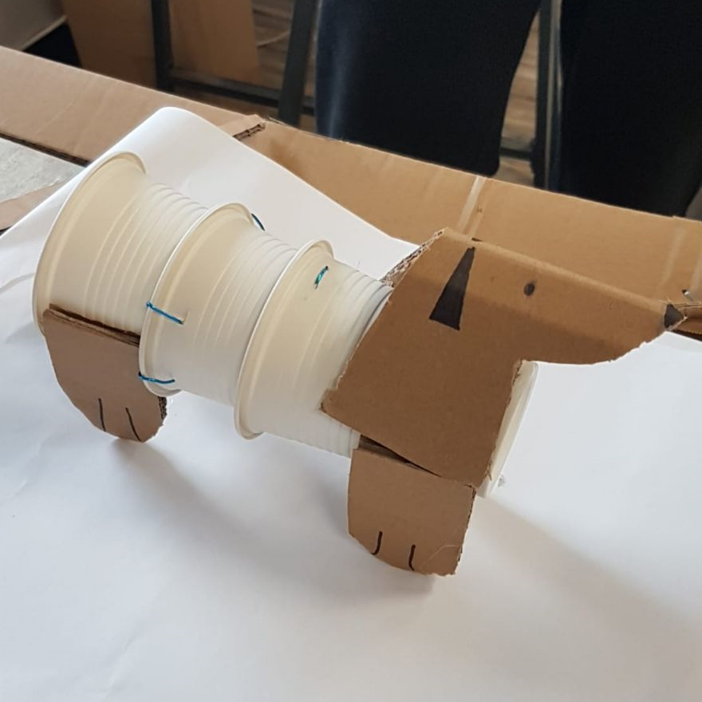
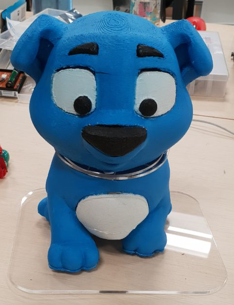

# WiFi Interactive Tracking Sidekick Robot  

### The WITS Robot is an interactive robot companion that empowers children to go on superhero adventures.  

## The Problem
There is lack of motivation for children to exercise especially if children suffering from cerebral palsy experience discomfort or pain.

## Our Target
We plan to target children below the age of 12 who are suffering from mild to moderate conditions of cerebral palsy.

## Our Purpose
We hope to encourage children suffering from cerebral palsy to move around and exercise more in order to prevent muscular atrophy and strengthen their muscles instead, therefore mitigating the effects of their cerebral palsy condition.  

It involves a physical therapist who will design an exercise program tailored to the needs of the patient to improve posture, prevent joint immobility, and slow down muscle weakness and atrophy.  

Stretching and strengthening exercises may help reduce spasticity, increase range of motion, and improve circulation.  

## Our Solution
We aim to deliver the best interactive companion that empowers children suffering from cerebral palsy to be more independent in fighting against their own conditions through fun and interactive ways.

### Features
1. Gamification
2. Exercise Tracking
3. Reminder System
4. Dataloop Feedback

## Our Product

### Workshop Prototype
We spent an hour building Brownie - our prototype puppy - for a quick presentation during Day 3 of the Makerthon 2019 Workshop.  


### Actual Product
Head down to Makerthon 2019 on the 7th of January to see our product live!  


## Future Developments
1. Incorporate more games with tracking functionalities
2. Overclocking for enhanced gaming performance


### Getting Started

These instructions will get you a copy of the project up and running on your local machine for development and testing purposes.   
The software was designed to be ran on a Raspberry Pi 3 Model B hardware and displayed on a 7" LCD Touchscreen.  
There is also additional communications to an Arduino hardware for sensors and motions on a robot dog model customized for our project.  
Feel free to add in or remove additional code as you deem fit for your own usage.  

#### Prerequisites

* [Python 3.5.3 or above](https://www.python.org/)
* [Raspberry Pi 3 Model B](https://www.raspberrypi.org/products/raspberry-pi-3-model-b/)
* [Rspberry Pi LCD - 7" Touchscreen](https://www.sparkfun.com/products/13733/)
* [Arduino Uno Rev3](https://store.arduino.cc/usa/arduino-uno-rev3/)

#### Installing

1. Clone the directory
2. Enter the directory by typing in this command

```
cd WITS-Robot
```

3. Install prerequisite libraries with setup.sh:

```
./setup.sh
```

### Usage

To run the main program, double click/tap on the main.sh script or enter the command:
```
./main.sh
```

To run the demo program instead, double click/tap on the demo.sh script or enter the command:
```
./demo.sh
```


## Built With

* Languages
    * [Python 3.5.3](https://www.python.org/) - For its standard libraries.

* Frameworks and Libraries
    * [Pygame](https://www.pygame.org/news) - For running games.


## Contributing

No public contributions expected as of now.

## Authors

* **Tan Yong He** - [tanyonghe](https://github.com/tanyonghe)
* **Wong Ding Feng** - [WongDingFeng](https://github.com/WongDingFeng)

## License

No license as of now.

## Acknowledgments

* Inspiration
* [FlapPyBird](https://github.com/sourabhv/FlapPyBird)
