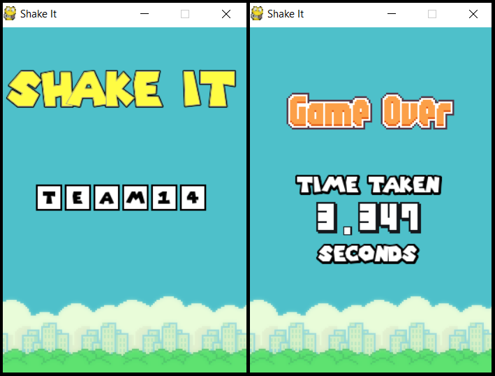
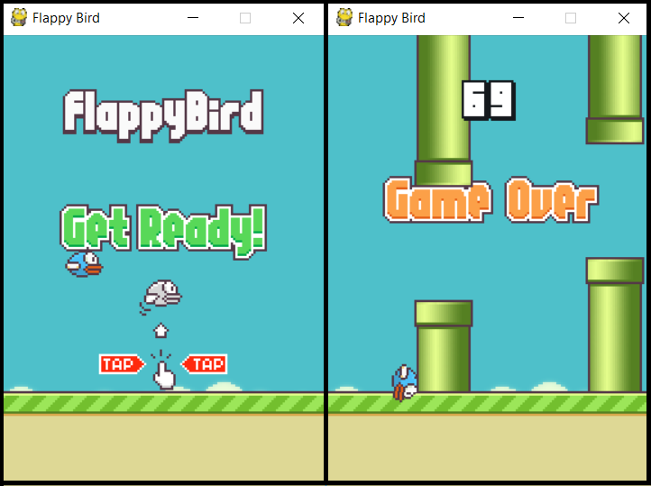

# Interactive Tracking Sidekick Robot - User Guide  

By: `Tan Yong He`      Since: `Dec 2018`      Licence: `N/A`

## Introduction

This software aims to perform the following functionalities:

* Program displays current time until it is time for an activity
* Upon time for an activity, the GUI will appear
* Depending on the given activity, the user can record activities using the webcam by pressing on `Start Activity`
* When the user finishes the activity, the user can stop the recording and return to the program using `End Activity`
* The user can also play games using the `Play Games!` button
* The games require a device that can send device motions via UDP to the program (e.g. a smartphone using SensorUDP)

## Quick Start

* Ensure you have Python version `3.5.3` or later installed in your Computer.

* Refer to <<Games>> for details of the available games.

## Games

### Shake It Game

Shake it to 100 as fast as possible!

* Shake your device to start the game and raise the number.
* The more you shake, the higher the number goes.
* The aim is to reach 100 as fast as possible.
* When the game is over, shake again to start a new round.

### Flappy Bird Game

Flap your way through the game!

* Shake your device to start the game and control the flappy bird.
* The more you shake, the higher the flappy bird goes.
* Keep the flappy bird in the middle of the screen and avoid the pipes as they come along.
* You gain 1 point for every pair of pipes successfully dodged.
* When the game is over, shake again to start a new round.

## FAQ

*Q*: How do I add or delete activities in the schedule list?  
*A*: Currently, there are APIs to help do this but the user has to manually call them by writing a script.  
